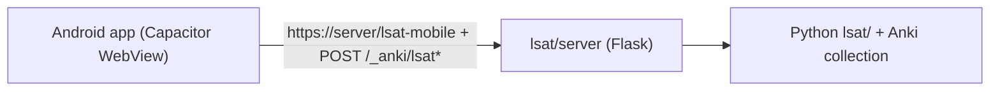

# LSAT Prep - Android app

An installable Android app (Capacitor) that is a thin WebView wrapper around the
existing `lsat-mobile` PWA. It loads the PWA + API from the hosted backend
([../lsat/server/](../lsat/server/README.md)), so it reuses all the LSAT UI and
the Python `lsat/` logic unchanged.



## Prerequisites

- Node 18+ and npm.
- Android Studio (bundles the Android SDK + JDK). Building an `.apk`/`.aab`
  requires the SDK; this repo does not include it.
- A reachable LSAT backend (see [../lsat/server/README.md](../lsat/server/README.md)).
  Build the PWA once (`./ninja sveltekit` from the repo root) so the server has
  something to serve.

## Build & run

From `mobile/`:

```bash
npm install

# Point the app at your server (baked in at sync time). Examples:
#   emulator, server on host:  http://10.0.2.2:8000/lsat-mobile
#   device on your Wi-Fi:       http://192.168.1.42:8000/lsat-mobile
#   hosted (recommended):       https://lsat.example.com/lsat-mobile#token=YOUR_TOKEN
export LSAT_SERVER_URL="http://10.0.2.2:8000/lsat-mobile"

npx cap add android        # generates the native android/ Gradle project (once)
# optional app icon: see resources/README.md, then `npm run assets`
npx cap sync android       # copies config + web shell into android/
npx cap open android       # opens Android Studio -> Run, or Build > Build APK/AAB
```

To change the server later, re-`export LSAT_SERVER_URL=...` and re-run
`npx cap sync android`.

## Pointing the app at the server

- The app loads `LSAT_SERVER_URL` in its WebView. The backend serves the PWA at
  `/lsat-mobile` and the API at `/_anki/lsat*` from the same origin, so no CORS.
- **Token:** if the server runs with `LSAT_SERVER_TOKEN`, put it in the URL
  fragment (`.../lsat-mobile#token=YOUR_TOKEN`). The PWA
  (`ts/lib/lsat/client.ts` `initToken`) reads it, stores it, sends it as a
  bearer on every API call, and strips it from the address bar.
- **HTTPS:** Android blocks cleartext HTTP by default. `capacitor.config.ts`
  auto-enables `cleartext` only for `http://` URLs (LAN/emulator). A hosted
  server should use `https://` behind a reverse proxy (see the server README).

## Notes / limitations

- This is a WebView wrapper, not native UI: it needs network reach to the
  backend (no offline data), consistent with reusing the PWA.
- The generated `android/` directory is git-ignored; regenerate it with
  `npx cap add android`. Everything needed to do so is in this folder.
- iOS is not set up here, but the same PWA works via `npx cap add ios`
  (Capacitor supports both) if you later want it.
