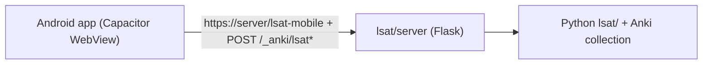

# LSAT Prep - Android app

An installable Android app (Capacitor) that is a thin WebView wrapper around the
existing `lsat-mobile` PWA. It loads the PWA + API from the hosted backend
([../lsat/server/](../lsat/server/README.md)), so it reuses all the LSAT UI and
the Python `lsat/` logic unchanged.



## Prerequisites

- Node 18+ and npm.
- Android Studio (bundles the Android SDK + JDK). Building an `.apk`/`.aab`
  requires the SDK; this repo does not include it.
- A reachable LSAT backend (see [../lsat/server/README.md](../lsat/server/README.md)).
  Build the PWA once (`./ninja sveltekit` from the repo root) so the server has
  something to serve.

## Build & run

From `mobile/`:

```bash
npm install

# Point the app at your server (baked in at sync time). Examples:
#   emulator, server on host:  http://10.0.2.2:8000/lsat-mobile
#   device on your Wi-Fi:       http://192.168.1.42:8000/lsat-mobile
#   hosted (recommended):       https://lsat.example.com/lsat-mobile#token=YOUR_TOKEN
export LSAT_SERVER_URL="http://10.0.2.2:8000/lsat-mobile"

npx cap add android        # generates the native android/ Gradle project (once)
# optional app icon: see resources/README.md, then `npm run assets`
npx cap sync android       # copies config + web shell into android/
npx cap open android       # opens Android Studio -> Run, or Build > Build APK/AAB
```

To change the server later, re-`export LSAT_SERVER_URL=...` and re-run
`npx cap sync android`.

## Pointing the app at the server

- The app loads `LSAT_SERVER_URL` in its WebView. The backend serves the PWA at
  `/lsat-mobile` and the API at `/_anki/lsat*` from the same origin, so no CORS.
- **Token:** if the server runs with `LSAT_SERVER_TOKEN`, put it in the URL
  fragment (`.../lsat-mobile#token=YOUR_TOKEN`). The PWA
  (`ts/lib/lsat/client.ts` `initToken`) reads it, stores it, sends it as a
  bearer on every API call, and strips it from the address bar.
- **HTTPS:** Android blocks cleartext HTTP by default. `capacitor.config.ts`
  auto-enables `cleartext` only for `http://` URLs (LAN/emulator). A hosted
  server should use `https://` behind a reverse proxy (see the server README).

## Offline review & reconnect sync

The app is **not** a purely network-dependent WebView. Study works offline:

- **Prefetch** — on open, the client caches a batch of items
  (`client.prefetchItems`, a no-answer payload), so review continues with no signal.
- **Durable answer queue** — a graded answer submitted while offline (or on a
  connectivity failure) is saved to `localStorage` and reported as _queued_, not lost
  (`client.postDurable` → `lsat-offline-queue`). The no-answer-leak invariant means
  grading is always server-side, so a queued answer is graded when it syncs.
- **Reconnect sync** — on the `online` event the queue is replayed to the server in
  order (`client.flushQueue`, wired by `client.initOfflineSync`), where each answer is
  graded and appended to the same append-only `PerformanceEvent` log. The Study tab
  shows an offline banner + a "N queued" count that clears on sync.
- **Exactly-once under a flaky radio** — the queue drops a row only after the server
  acks it, and each submission carries a stable `_idempotency` id the server dedupes
  against (`lsat.events.idempotent_lookup`), so a lost ack that triggers a re-POST can
  never double-log an event. Proven by `qt/tests/test_lsat_idempotency.py`.

This flow is **recorded on video** at
[`docs/offline-sync-recording.webm`](../docs/offline-sync-recording.webm) (the real PWA
in Chromium: offline banner → "Saved offline" → syncs on reconnect), covered by
`ts/lib/lsat/client.offline.test.ts` (`just test-ts`) and the Playwright e2e
(`playwright.offline.config.ts`), and demonstrated end-to-end by `sync/offline_demo.py`
(`make sync-demo`). See [`docs/verification.md`](../docs/verification.md).

**Two deployment modes** (see `capacitor.config.ts`), both offline-review capable:

| Mode                           | Shell loads from                | Offline shell?                           | Build                                                                                                                   |
| ------------------------------ | ------------------------------- | ---------------------------------------- | ----------------------------------------------------------------------------------------------------------------------- |
| **Remote** (default)           | the hosted PWA over the network | needs network to load first each session | `LSAT_SERVER_URL=… npx cap sync android`                                                                                |
| **Local bundle** (recommended) | the PWA bundled _into_ the app  | ✅ loads with no network                 | `./ninja sveltekit && cp -r "$BUILD_ROOT"/sveltekit/* www/ && LSAT_LOCAL_BUNDLE=1 LSAT_API_BASE=… npx cap sync android` |

In local-bundle mode the shell reaches the server at the absolute `LSAT_API_BASE`
(persisted from a one-time `#api=…&token=…` pairing link → `client.apiBase()`), so the
app opens and lets you review even with the radio off, syncing when it comes back.

## Notes / limitations

- The generated `android/` directory is git-ignored; regenerate it with
  `npx cap add android`. Everything needed to do so is in this folder.
- iOS is not set up here, but the same PWA works via `npx cap add ios`
  (Capacitor supports both) if you later want it.
